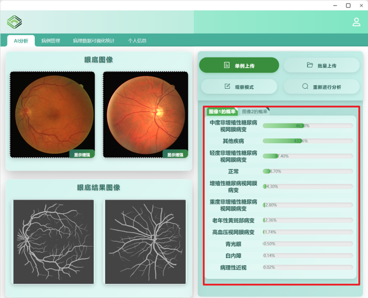
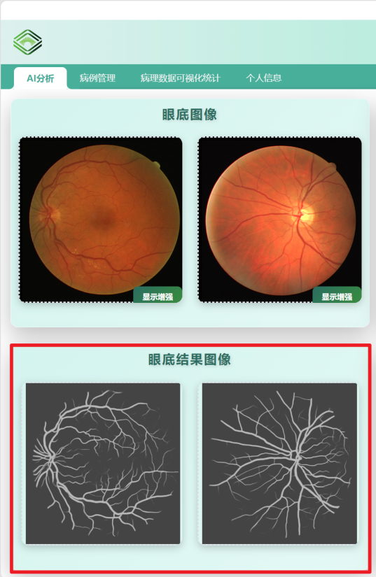
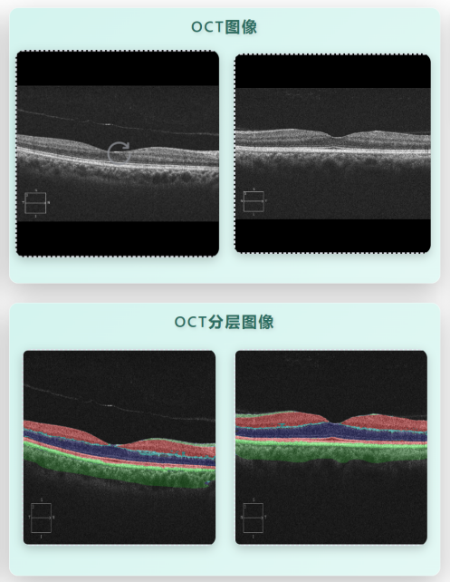
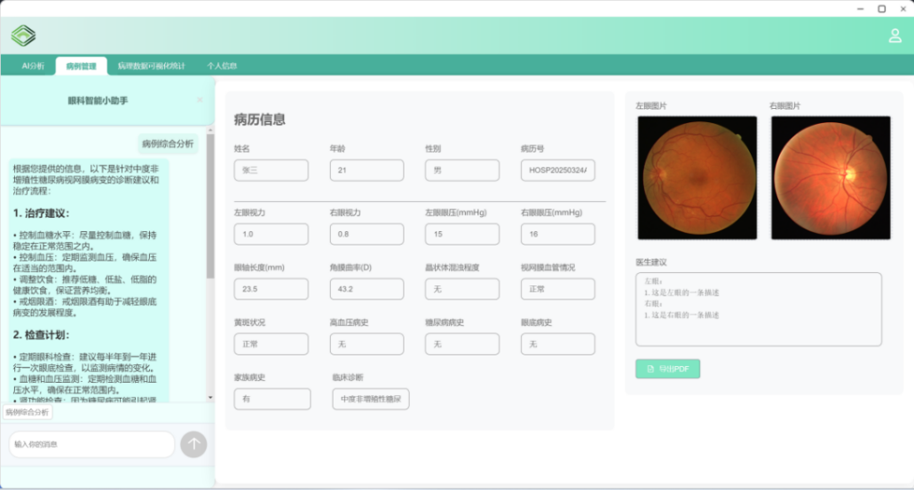
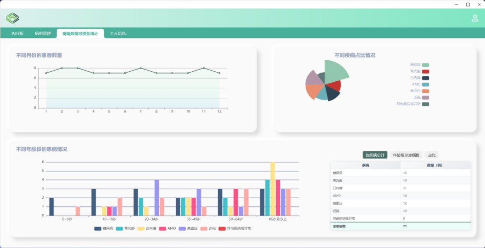

# 荣耀·根源之目 - 眼科疾病智能诊断系统
> 基于多模态AI与大语言模型的眼底医学影像全流程智能辅助诊断平台

本项目构建了**「影像分析-特征提炼-决策建议」**全链条智能诊断体系，创新采用「多深度学习网络独立分析 + 大语言模型决策增强」架构，实现眼底彩照与OCT影像的自动化分析，为各级医疗机构提供精准、高效、低成本的眼科疾病辅助诊断解决方案，助力缓解医疗资源分布不均、基层诊断效率低、漏诊误诊率高等行业痛点。

---

## 📺 项目路演视频
点击下方视频可快速了解项目核心功能与技术亮点：

https://github.com/user-attachments/assets/941c6b69-f89c-4e73-9d9d-bc475a005459

<video width="100%" controls autoplay loop muted>
  <source src="./assets/videos/荣耀·根源之目-基于眼底医学影像的眼科疾病智能诊断系统-项目演示视频.mp4">
</video>

---

## 目录
- [荣耀·根源之目 - 眼科疾病智能诊断系统](#荣耀根源之目---眼科疾病智能诊断系统)
  - [📺 项目路演视频](#-项目路演视频)
  - [目录](#目录)
  - [项目核心痛点](#项目核心痛点)
  - [核心技术亮点](#核心技术亮点)
  - [📸 核心功能运行截图](#-核心功能运行截图)
    - [1. 多级眼疾分类功能](#1-多级眼疾分类功能)
    - [2. 眼底血管分割功能](#2-眼底血管分割功能)
    - [3. OCT图像分层分析功能](#3-oct图像分层分析功能)
    - [4. 大模型辅助诊断与报告生成](#4-大模型辅助诊断与报告生成)
    - [5. 病例数据可视化统计](#5-病例数据可视化统计)
  - [核心功能模块](#核心功能模块)
  - [核心技术栈](#核心技术栈)
  - [系统核心特性](#系统核心特性)
  - [应用场景](#应用场景)
  - [未来规划](#未来规划)
  - [📦 项目运行说明](#-项目运行说明)

---

## 项目核心痛点
针对当前眼科智能诊断领域的核心行业问题，本项目进行了针对性技术优化：
1.  **影像质量不稳定**：不同设备/环境采集的影像质量参差不齐，严重影响诊断准确性；
2.  **算法泛化能力不足**：单一检测网络难以适配多样化临床场景，易出现漏诊、误诊；
3.  **诊断可解释性差**：传统系统仅输出诊断结果，缺乏临床可解释性，难以建立医生对AI的信任。

---

## 核心技术亮点
1.  **四大网络协同计算**：覆盖疾病分类、分期、结构分割全流程，主分类网络眼疾识别准确率达84%，亚分类网络资源消耗降低35%；
2.  **双阶段分级诊断**：构建「粗筛-细判」诊断流程，早期病变识别率提升25%，单张影像推理耗时≤200ms（RTX 3060）；
3.  **鲁棒性影像预处理**：基于CIECAM02色彩感知算法优化低质量影像，血管细节可见性提升30%，预处理后有效检测率提升40%；
4.  **大模型可解释性增强**：DeepSeek大模型深度整合多网络结果与临床数据，生成标准化诊断建议，缩短医生决策时间30%；
5.  **人机双向验证机制**：支持医生对病灶区域交互式标注，融合临床经验校准AI结果，兼顾AI效率与专家经验可靠性。

---

## 📸 核心功能运行截图

### 1. 多级眼疾分类功能

*主分类网络识别8类常见眼疾，亚分类网络完成疾病早/中/晚期精准分期*

### 2. 眼底血管分割功能

*基于LadderNet精准提取视网膜血管细微结构，支持血管病变量化分析*

### 3. OCT图像分层分析功能

*Transformer U-Net实现9层视网膜组织分层分割，辅助结构性病变检测*

### 4. 大模型辅助诊断与报告生成

*DeepSeek大模型整合多源数据生成结构化诊断建议，支持PDF报告导出*

### 5. 病例数据可视化统计

*基于ECharts实现疾病数据三维可视化统计分析，辅助临床科研*

---

## 核心功能模块
| 功能模块 | 能力说明 |
| :--- | :--- |
| **多级眼疾分类** | 主分类网络实现8类常见眼疾（青光眼、糖尿病视网膜病变等）初筛，亚分类网络完成疾病早/中/晚期精准分期 |
| **多模态影像分割** | 精准提取眼底血管细微结构，实现OCT影像9层视网膜组织分层分割，为病变量化分析提供解剖学依据 |
| **眼底图像增强** | 优化低对比度、光照不均的低质量影像，突出病灶区域细节，降低不同设备采集的影像质量差异对诊断的影响 |
| **大模型辅助诊断** | 整合多源影像特征与临床数据，生成包含治疗建议的结构化诊断报告，支持自然语言交互式临床决策参考 |
| **交互式病灶标注** | 支持图像缩放、对比度调节、病灶区域手动标注与修正，实现AI结果与医生临床经验的双向验证 |
| **病例数据管理** | 支持病例批量导入/导出、多维度检索，基于ECharts实现疾病数据三维可视化统计分析，辅助临床科研 |

---

## 核心技术栈
| 技术领域 | 选型方案 |
| :--- | :--- |
| **AI算法** | Python、PyTorch、OpenCV、TensorRT |
| **后端服务** | FastAPI、Redis（缓存加速） |
| **前端交互** | Vue 2.0、JavaScript、HTML5 Canvas、ECharts |
| **数据存储** | MySQL（结构化数据存储） |
| **大模型能力** | DeepSeek 大语言模型 |
| **工程化** | Docker、Git |

---

## 系统核心特性
1.  **技术创新性**：首创多网络独立分析+大模型决策增强架构，兼顾分类、分割、分期全流程，解决单一网络泛化能力不足的问题；
2.  **临床实用性**：保留医生主动标注与结果修正能力，AI结果与临床判断可双向验证，贴合临床真实诊疗流程；
3.  **高效易用性**：前后端分离架构，前端可视化界面操作便捷，后端支持高并发处理，适配基层医疗机构轻量化硬件部署；
4.  **安全合规性**：采用JWT令牌鉴权、BCrypt加密、HTTPS传输，敏感数据脱敏处理，符合医疗数据安全规范，保障患者隐私。

---

## 应用场景
1.  **基层医疗机构**：适配低设备条件，实现眼疾低成本初筛，降低漏诊风险，缓解专业眼科医生短缺问题；
2.  **大型/专科医院**：辅助复杂病例诊断，提升医生诊疗效率，为临床决策提供可解释性参考；
3.  **远程医疗平台**：支持云端实时影像处理，适配低带宽环境，实现跨地域眼科诊断支持；
4.  **科研机构**：提供算法验证与模型训练平台，支持病例数据统计分析，助力医工结合领域研发。

---

## 未来规划
项目已验证眼科AI辅助诊断的核心技术路径，后续将持续优化多模态数据融合能力与跨设备兼容性，通过模块化设计开放接口，支持医疗机构灵活接入本地化诊断模型与第三方健康数据源，逐步扩展为开放型眼健康管理平台，为分级诊疗体系提供轻量化、可定制的智能诊断工具。

---

## 📦 项目运行说明
> ⚠️ **重要提示**：
> 
> 由于本项目包含深度学习模型权重文件与大模型参数文件，文件体积较大，未随本仓库上传。
> 
> **如需完整运行该项目，请联系我获取大模型参数文件与模型权重文件。**
